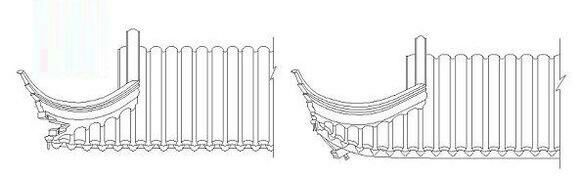

#### 七朱八白

`重楣`（双重阑额） -> 演化为 `七朱八白`

> 传统建筑史观点认为，七朱八白源自唐代建筑的“重楣”（即双重阑额）结构：阑额是柱上用于承接、连接柱头的水平构件，南北朝末以来，阑额（楣）由柱上降到柱顶两侧，并分上下2层，中间连以若干短柱，《明堂规制诏》中称之为“重楣”。重楣的连系支撑作用远比用一层阑额要大，对维持柱列稳定有更大作用。大约中晚唐时，由于铺作层发展得更为完善，逐渐简化为单层阑额，但依然用刷出“七朱八白”彩画，模仿重楣之形。

#### 嫰戗发戗

屋角起翘的不同结构做法：

- 水戗:屋檐平直 ，角脊起翘
- 嫩戗:屋角子角梁起翘，屋檐不平直，屋角处连屋檐一起起翘。

左边水戗！ 右边嫩戗！ 

#### 铺作跳头方式

- 令栱 + 撩檐枋
- 令栱 + 替木 + 撩风椽
- 跳头不用令拱，只用替木承撩风椽

令栱 + 替木 + 撩风椽：

