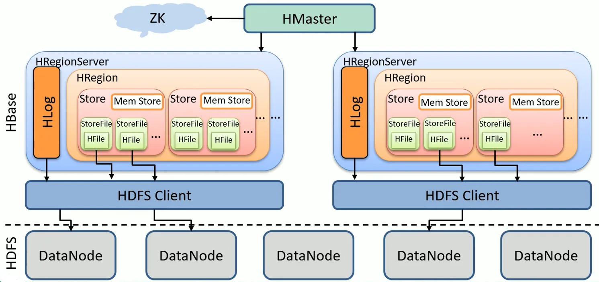

分布式存储的经典问题：数据是如何分布的？

这个问题在 KV 存储领域，就是 Key 是怎么分布到存储节点上的问题

一般的解决方案：

1、一致性hash

2、hash后对16384取模，配合路由表

google 论文：《Bigtable：一个结构化数据的分布式存储系统》

Hbase是Apache对bigtable论文的一个开源实现

google论文：F1/Spanner

TiDB对应F1，TiKV对应Spanner，是PingCAP的开源实现

