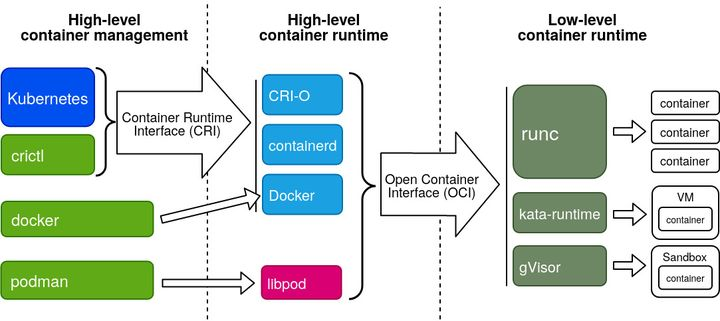
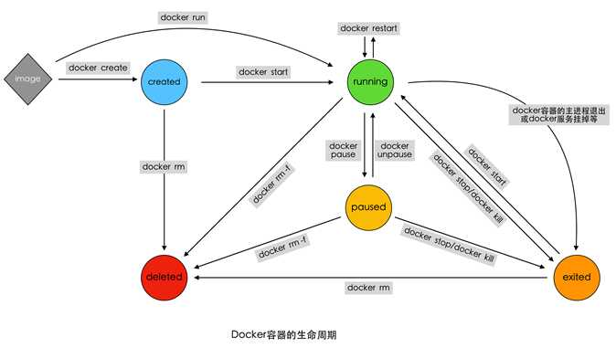

> 容器是提供一个与宿主机系统共享内核但与系统中的其他进程资源相隔离的执行环境。


### 运行中的容器究竟是什么？

#### 容器有它自己的内核吗？

> 共享内核、独享内核是两种不同的实现方式，共享内核执行效率更高，独享内核安全性更高
>
> 可以以共享内核来学习容器，之后再了解独享内核相关的知识

Docker容器使用主机操作系统的内核，容器没有自定义或者附加的内核；所有容器共享“主机”上的内核。

#### Linux 的 `bootfs` 和 `rootfs` 

 一个典型的 Linux 系统要能运行的话，它至少需要两个文件系统：

- boot file system （bootfs）：包含 boot loader 和 kernel。用户不会修改这个文件系统。实际上，在启动（boot）过程完成后，整个内核都会被加载进内存，此时 bootfs 会被卸载掉从而释放出所占用的内存。同时也可以看出，对于同样内核版本的不同的 Linux 发行版的 bootfs 都是一致的。

- root file system （rootfs）：包含典型的目录结构，包括 /dev, /proc, /bin, /etc, /lib, /usr, and /tmp 等再加上要运行用户应用所需要的所有配置文件，二进制文件和库文件。这个文件系统在不同的Linux 发行版中是不同的。而且用户可以对这个文件进行修改。

由此可见，每个镜像相当于一个没有bootfs的Linux发行版，运行时使用主机操作系统的内核；


### 容器标准

相对较为正式的术语定义如下图，可以把容器管理系统分为三层：

High-level Container Management：容器管控的UI层。直接实现容器的管控和使用界面，也是用户最熟悉的子系统。

High-level Container Runtime：容器状态及资源供给。包括镜像管理、网络接入、容器状态、调用Low Level Runtime执行容器等功能。习惯上这层称之为容器引擎（Container Engine）。

Low-level Container Runtime：容器执行层。负责具体构建容器运行环境并执行容器进程。习惯上这层直接简称为容器运行时（Container Runtime）。

- High-level Container Management和Container Engine之间的接口规范是CRI

- Container Engine和Container Runtime之间的接口规范是OCI。




**容器引擎的核心是**：准备运行容器所需要的资源 以及 管理容器生命周期。


#### 支持CRI接口的容器引擎有：

- Docker
- rkt
- pouch
- containerd（从Docker中剥离出来）
- cri-o（没有Docker的包袱，架构更简洁，成熟度不确定）


#### 容器运行时：

runC


#### 容器领域的CAP：

- 资源效率
- 安全隔离
- 标准通用


### 容器核心技术

#### 1、Namespace

| Namespace | 系统调用        | 隔离内容                             | 内核版本（时间） |
| --------- | --------------- | ------------------------------------ | ---------------- |
| Mount     | CLONE_NEWNS     | 挂载点（看调用名就知道最早）         | 2.4.19           |
|           | CLONE_NEWUTS    | nodename（主机名）domainname（域名） | 2.6.19           |
|           | CLONE_NEWIPC    | 信号量、消息队列、共享内存           | 2.6.19           |
|           | CLONE_NEWPID    | 进程号                               | 2.6.24           |
|           | CLONE_NEWNET    | 网络设备、ip地址、端口等             | 2.6.29           |
|           | CLONE_NEWUSER   | 用户、组                             | 3.8              |
|           | CLONE_NEWCGROUP |                                      |                  |

```
1、PID namespace可以嵌套，就是有父子关系
2、父 namespace可以看 以所有后代namespace的进程信息
3、子namespace看不到父namespace 或 兄弟namespace的进程信息

目前PID namespace最多可以嵌套32层，在内核中使用MAX_PID_NS_LEVEL来定义。
```


#### 2、CGroup

#### 3、Union File System

特点：

- 分层
- 写时复制
- 内容寻址
- 联合挂载

#### 4、rootfs切换

使用`pivot_root`系统调用来实现


### 容器的生命周期



