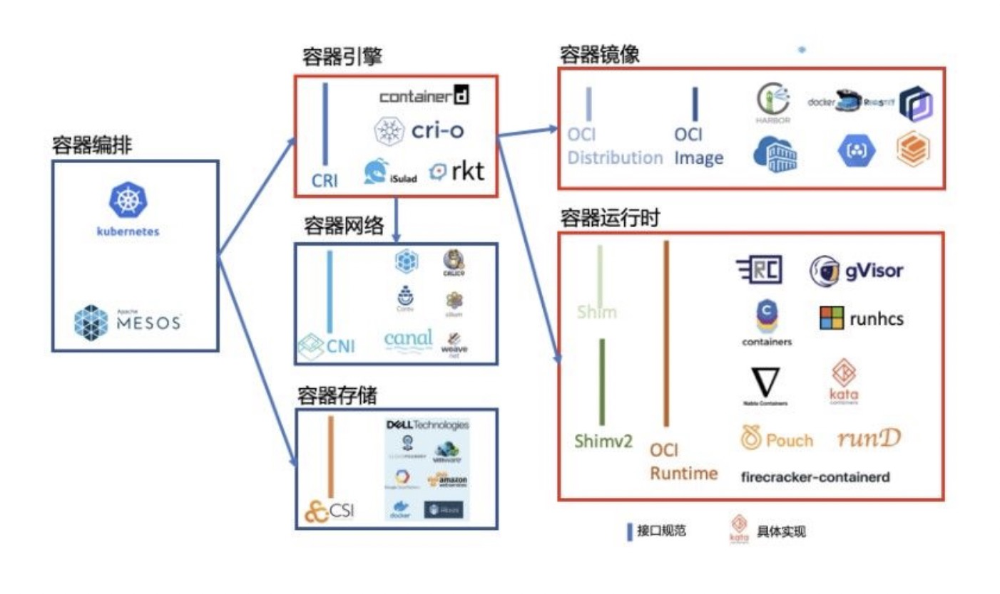

> 容器是提供一个与宿主机系统共享内核但与系统中的其他进程资源相隔离的执行环境。

### 运行中的容器究竟是什么？

#### 容器有它自己的内核吗？

Docker容器使用主机操作系统的内核，容器没有自定义或者附加的内核；所有容器共享“主机”上的内核。

#### Linux 的 `bootfs` 和 `rootfs` 

 一个典型的 Linux 系统要能运行的话，它至少需要两个文件系统：

- boot file system （bootfs）：包含 boot loader 和 kernel。用户不会修改这个文件系统。实际上，在启动（boot）过程完成后，整个内核都会被加载进内存，此时 bootfs 会被卸载掉从而释放出所占用的内存。同时也可以看出，对于同样内核版本的不同的 Linux 发行版的 bootfs 都是一致的。

- root file system （rootfs）：包含典型的目录结构，包括 /dev, /proc, /bin, /etc, /lib, /usr, and /tmp 等再加上要运行用户应用所需要的所有配置文件，二进制文件和库文件。这个文件系统在不同的Linux 发行版中是不同的。而且用户可以对这个文件进行修改。

由此可见，每个镜像相当于一个没有bootfs的Linux发行版，运行时使用主机操作系统的内核；

### 容器标准

#### CRI（容器运行时接口）

> kubelet 使用 grpc 的方式，通过 CRI 接口 和容器运行时交互

CRI规定了 `ImageService` 和 `RuntimeService` 2类接口：

##### ImageService

- 列出存在的镜像
- 查询镜像状态
- 拉取镜像
- 删除镜像
- 查询镜像文件系统信息

RuntimeService

- 

#### OCI（开放容器接口）

### docker 核心技术

#### 1、Namespace

| Namespace | 系统调用        | 隔离内容                             | 内核版本（时间） |
| --------- | --------------- | ------------------------------------ | ---------------- |
| Mount     | CLONE_NEWNS     | 挂载点（看调用名就知道最早）         | 2.4.19           |
|           | CLONE_NEWUTS    | nodename（主机名）domainname（域名） | 2.6.19           |
|           | CLONE_NEWIPC    | 信号量、消息队列、共享内存           | 2.6.19           |
|           | CLONE_NEWPID    | 进程号                               | 2.6.24           |
|           | CLONE_NEWNET    | 网络设备、ip地址、端口等             | 2.6.29           |
|           | CLONE_NEWUSER   | 用户、组                             | 3.8              |
|           | CLONE_NEWCGROUP |                                      |                  |

#### 2、CGroup

#### 3、Union File System

特点：

- 分层
- 写时复制
- 内容寻址
- 联合挂载

