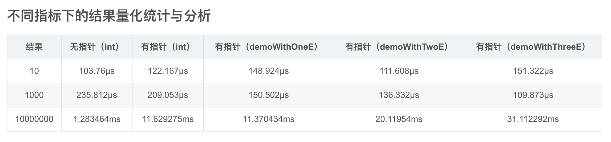

### GC优化

#### 1、大的map，kv尽量不要有指针类型(string等)

```
After go version 1.5, if you use a map without pointers in keys and values, the GC will omit its content.
在go版本1.5之后，如果使用键和值中没有指针的map，GC将忽略其内容。
```



