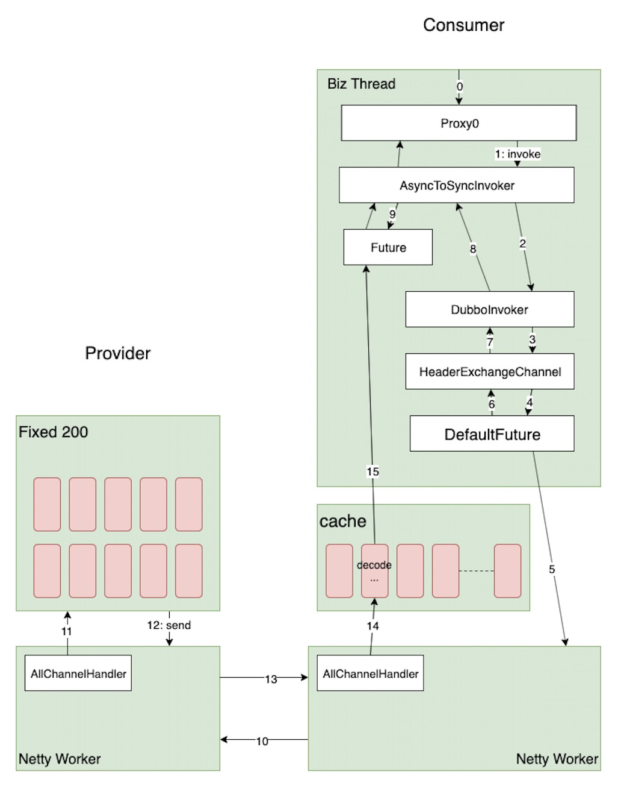

### 一、2.7.5之前的线程模型存在的问题

在2.7.5之前的这个模型中有个问题（https://github.com/apache/dubbo/issues/2013）

case是这样的，当provider由于某些原因处理较慢，积攒了很多的请求，然后情况突然好转，大量的Response发送给了consumer，此时consumer端会在cache线程池中创建大量的线程

### 二、2.7.5之前的线程模型



上图主要描述了一次远程调用的过程，其中绿色的是线程池/线程，白色的是几个主要过程所在的类

我们看一下在2.7.5之前的线程模型中，是如何调用的（其中我们忽略一些不关心的细节）

1. 首先在右上角的绿色块中，业务线程进行调用，然后交给netty（现在不在netty的eventLoop线程中，所以会将写数据作为一个task放到任务队列中），返回一个future
2. 在AsyncToSync中，如果是同步调用的，则会调用future.get等待返回结果或者超时
3. 在左边provider这里，netty收到消息之后，进行Dispatcher，默认的是AllCahnnelHandler，然后会交给dubbo的线程池去处理（fixed200，创建入口在NettyServer中）
4. 当provider处理完之后将Response发回
5. consumer端收到消息之后，io线程会调用AllChannelHandler进行分派，收到的请求会交给cache线程池来处理，处理的主要逻辑是：解码、调用future的complete等
6. AsyncToSyncInvoker的get返回

总结：consumer收response的过程：IO线程做初步的解码，consumer端线程池做反序列化，然后唤醒业务线程


### 三、2.7.5对线程模型的改进


在2.7.5中，将消费者端接收Response的线程池做了改进，引入了一个ThreadLessExecutor的组件，类似于一个线程池，其实是在内部有个BlockingQueue，结果的消费者自己来执行一些逻辑；

和2.7.5之前的相比，将原来cacha线程池中执行的逻辑放到了业务线程中，避免了大量cache线程的创建


### 总结：

同步调用：consumer收response的过程：IO线程做初步的解码，业务线程做反序列化

异步调用：consumer收response的过程：IO线程做初步的解码，consumer端线程池做反序列化及callback执行


### 四、sofa-rpc 的相关逻辑

1、所有的response都会放到默认线程池（或自定义线程池）处理

2、反序列化操作默认都是在业务线程处理

```java
// 这里是同步调用的主要逻辑
public Object invokeSync(final Connection conn, final Object request,
                         final InvokeContext invokeContext, final int timeoutMillis)
                                                                                    throws RemotingException,
                                                                                    InterruptedException {
    RemotingCommand requestCommand = toRemotingCommand(request, conn, invokeContext,
        timeoutMillis);
    preProcessInvokeContext(invokeContext, requestCommand, conn);
 
 
    // 发送请求，异步转同步
    ResponseCommand responseCommand = (ResponseCommand) super.invokeSync(conn, requestCommand,
        timeoutMillis);
    responseCommand.setInvokeContext(invokeContext);
 
    // 将返回结果反序列化为期望的对象
    Object responseObject = RpcResponseResolver.resolveResponseObject(responseCommand,
        RemotingUtil.parseRemoteAddress(conn.getChannel()));
    return responseObject;
}
```

