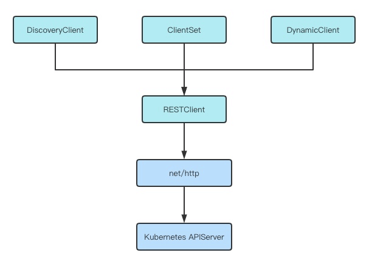

### Example

[client-go Example](https://github.com/Nailcui/client-go-example)

### GVR/GVK

### 4种客户端对象

#### 1、RESTClient
RESTClient是最基础的客户端，对HTTP Request进行了封装，实现了RESTful风格的API，其他的三个client都是基于RESTClient实现的。

#### 2、ClientSet
ClientSet在RESTClient的基础上封装了对Resource和Version的管理方法，每一个Resource和Version都以函数的方式暴露给开发者。ClientSet只能够处理Kubernetes内置资源，不能直接访问CRD自定义资源。ClientSet是通过client-gen代码生成器自动生成的。

#### 3、DynamicClient
DynamicClient和ClientSet最大的区别在于，DynamicClient能够访问Kubernetes中的所有资源对象，包含Kubernetes内置资源和CRD自定义资源。

#### 4、DiscoveryClient
用于发现kube-apiserver所支持的资源组(Group)，资源版本(Versions)，资源信息(Resources)

### Infomer

