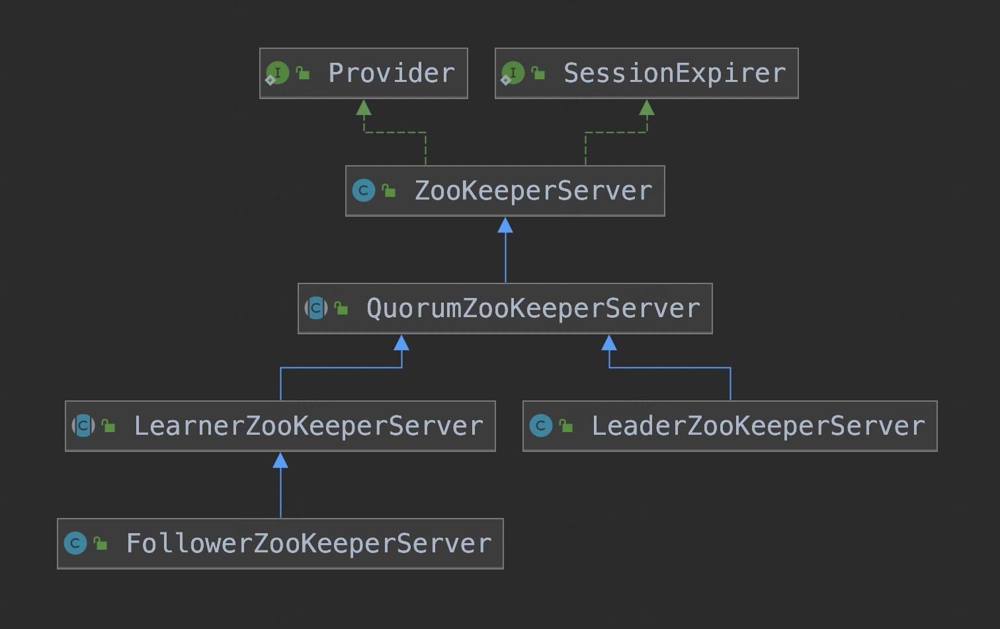
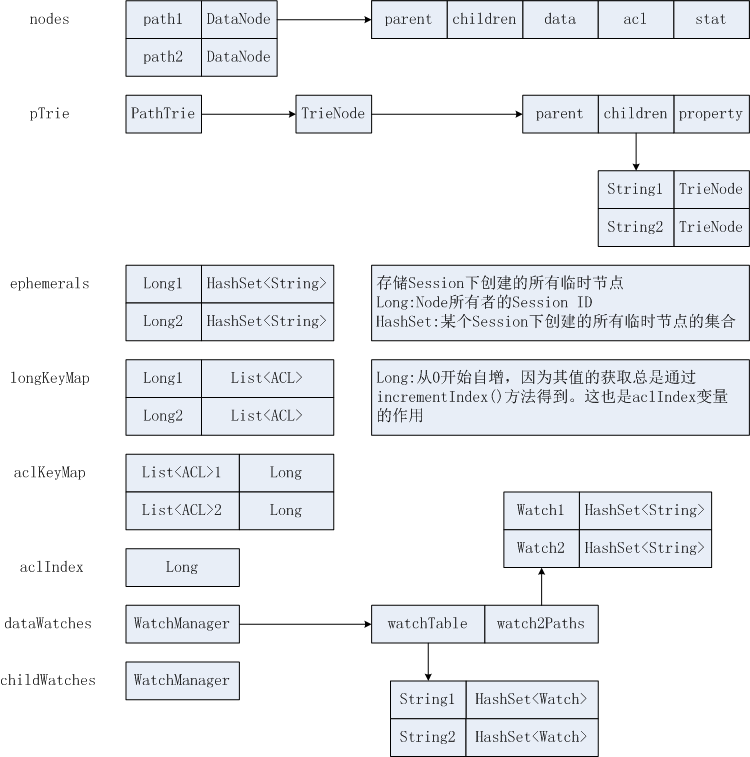

# zookeeper 源码阅读


## 一、版本选择

本系列文章选择的zk版本是 `3.6.3`，各大版本功能如下，可以看到主要功能在3.6已经基本完成

| 版本 | 最新版本         | 特性                                                         | 其他软件依赖情况                                     |
| :--- | :--------------- | :----------------------------------------------------------- | :--------------------------------------------------- |
| 版本 | 最新版本         | 特性                                                         | 其他软件依赖情况                                     |
| 3.8  | 3.8.0-1 18天之前 | [官网介绍](https://zookeeper.apache.org/doc/r3.8.0/releasenotes.html)强制执行配额限制；<br />故障注入框架：Byteman for zookeeper<br />配额指标展示到Prometheus<br />metrics告警文档 |                                                      |
| 3.7  | 3.7.0-2 一年之前 | [详细参考文档](https://blog.100boot.cn/post/3391)<br />[官网介绍](https://zookeeper.apache.org/doc/r3.7.0/releasenotes.html)<br />强制执行配额限制；<br />从 Java 启动 ZooKeeper 服务器的官方 API；更多用于测试等情况<br />添加 whoami API 和 Cli 命令； <br />为 ZooKeeperServer 测试引入确定性的运行时行为注入框架； |                                                      |
| 3.6  | 3.6.3-2          | [详细参考文档](https://blog.csdn.net/csdnzxm/article/details/105646728)<br />添加`getEphemerals`用于获取会话创建的所有临时节点<br />集成ZooKeeper的可插拔指标系统<br />审核日志（默认禁用）<br />zkSnapShotToolkit.sh：将快照数据转换成标准输出或者json文件<br />zkTxnLogToolkit.sh：能够恢复带有损坏CRC的事务日志条目<br />允许事务日志刷新延迟<br />添加根据日志大小添加到快照的选项 <br />对client、server添加db唯一id标志，用于解决异常情况下的[问题](https://issues.apache.org/jira/browse/ZOOKEEPER-27)<br />强制认证功能（默认不开启）<br />CLI中添加一个 ls -R 参数，类似 tree命令<br />内部数据的一致性检查，有开关，有性能消耗，官方测试总体上没什么影响：[文档](https://issues.apache.org/jira/browse/ZOOKEEPER-3114)<br />观察者可连接到follower，降低leader压力<br />添加命令，支持统计某个节点下的所有节点数量 | elastic-job 3.x依赖此版本sharding-jdbc 5.x依赖此版本 |
| 3.5  | 3.5.9-rc2        | 详细参考文档<br />动态重新配置<br />新节点类型：容器，TTL<br />观察者可删除<br />升级到Netty 4.1<br />maven构建<br />新增一个内置的管理http接口，默认启动，可关闭 |                                                      |


## 二、源码环境准备

### 1、下载代码

```
git clone https://github.com/apache/zookeeper.git
```

### 2、代码导入idea

```
# 此时会提示如下异常
java: 程序包org.apache.zookeeper.proto不存在
```

### 3、编译代码

```
mvn -DskipTests=true clean install
```


## 三、单机启动

单机启动主类: `org.apache.zookeeper.server.ZooKeeperServerMain`

### 单机server

项目中新建配置文件 `./conf/zoo.standalone.cfg`，内容如下：

```
tickTime=2000
initLimit=10
syncLimit=5
dataDir=/tmp/zookeeper/data
dataLogDir=/tmp/zookeeper/logs
clientPort=2181
maxClientCnxns=300
```

启动配置 Program arguments：

```
# 配置文件地址
/Users/xxx/zookeeper-release-3.6.3/conf/zoo.standalone.cfg
```

日志配置 VM Options:

```
-Dlog4j.configuration=file:/Users/cuidingyu/project/nailcui/zookeeper-release-3.6.3/conf/log4j.properties 
```


可能出现异常：

```
Caused by: java.lang.ClassNotFoundException: org.apache.commons.cli.ParseException
```

解决办法：

注释掉相关的 `provided` 

```
<!--      <scope>provided</scope>-->
```


### 客户端：

主类: `org.apache.zookeeper.ZooKeeperMain` 

参数: `-server localhost:2181 ls /`


## 四、单机server主要逻辑

启动栈帧:

```
"main@1" prio=5 tid=0x1 nid=NA runnable
  java.lang.Thread.State: RUNNABLE
	  at org.apache.zookeeper.server.ZooKeeperServer.startupWithServerState(ZooKeeperServer.java:683)
	  at org.apache.zookeeper.server.ZooKeeperServer.startup(ZooKeeperServer.java:670)
	  - locked <0x6bc> (a org.apache.zookeeper.server.ZooKeeperServer)
	  at org.apache.zookeeper.server.NettyServerCnxnFactory.startup(NettyServerCnxnFactory.java:723)
	  at org.apache.zookeeper.server.ServerCnxnFactory.startup(ServerCnxnFactory.java:130)
	  at org.apache.zookeeper.server.ZooKeeperServerMain.runFromConfig(ZooKeeperServerMain.java:159)
	  at org.apache.zookeeper.server.ZooKeeperServerMain.initializeAndRun(ZooKeeperServerMain.java:112)
	  at org.apache.zookeeper.server.ZooKeeperServerMain.main(ZooKeeperServerMain.java:67)
```


关键入口: `NettyServerCnxnFactory.startup` 

### processor

`PrepRequestProcessor` -> `SyncReqeustProcessor` -> `FinalRequestProcessor` 

#### PrepRequestProcessor

- 设置事务头
- 权限校验
- 构造变更Record，并入队
- 入队逻辑:

```

    protected void addChangeRecord(ChangeRecord c) {
        synchronized (zks.outstandingChanges) {
            zks.outstandingChanges.add(c);
            zks.outstandingChangesForPath.put(c.path, c);
            ServerMetrics.getMetrics().OUTSTANDING_CHANGES_QUEUED.add(1);
        }
    }

```

- nextProcessor.processRequest

#### SyncReqeustProcessor

提交到本地日志，不写入内存数据库；单机&Follower都有这个逻辑


- 写到底层事务日志
- 尝试快照
    - 如果到了新快照的时候：
    - roll log
- 新线程去快照，如果上一个快照还在执行，就跳过
- flush里有nextProcessor.processRequest

#### FinalRequestProcessor

- zks.processTxn：这里是真正的逻辑
    - processTxnInDB：写到`datatree` 
    - if: writeRequest
        - 处理`outstandingChanges`
    - if: quorumRequest
        - getZKDatabase().addCommittedProposal(request)


## 五、集群 server 逻辑




### FollowerProcessor

> 1、FollowerRequestProcessor -> CommitProcessor -> FinalRequestProcessor
>
> 2、SyncRequestProcessor -> SendAckRequestProcessor


当收到集群的提议"proposal"：`syncProcessor.processRequest(request);`

当收到集群的"commit"：`commitProcessor.commit(request);`

当收到客户端的write请求：

- `nextProcessor.processRequest(request);`，在CommitProcessor处理
- `zks.getFollower().request(request);`，提交给Leader


#### FollowerRequestProcessor

- nextProcessor.processRequest(request);
- 

####CommitProcessor 

请求转发后，就达到这里，逻辑和`Leader` 的`CommitProcessor` 一样；

这里对应到leader的commit，当leader收到超过半数的投票，后发送commit请求，到达这里


#### FinalRequestProcessor

同单机


### LeaderProcessor

> 1、PrepRequestProcessor -> ProposalRequestProcessor -> CommitProcessor -> ToBeAppliedRequestProcessor -> FinalRequestProcessor
>
> 2、CommitProcessor -> ToBeAppliedRequestProcessor -> FinalRequestProcessor

#### PrepRequestProcessor

#### ProposalRequestProcessor

- 如果是`LearnerSyncRequest`
    - 处理sync请求
- 否则：
    - nextProcessor.processRequest(request)
    - zks.getLeader().propose(request)：发起提议
    - syncProcessor.processRequest(request)：添加到`SyncReqeustProcessor`的处理队列中

#### CommitProcessor

```
// 所有的Request都会放到这里一次；上一个processor来的
queuedRequests = new LinkedBlockingQueue<Request>();

// 只有需要写的request才会放到这里；上一个processor来的
queuedWriteRequests = new LinkedBlockingQueue<>();

// 本session的请求队列；如果有个read前有个write，那这个read就得在这里等着
pendingRequests = new HashMap<>(10000);

// 收到足够的投票，就塞进这里
committedRequests = new LinkedBlockingQueue<Request>();


```

这个processor主要负责将已经完成本机submit的request和已经在集群中达成commit的request匹配，并将匹配后的request交给nextProcessor（即ToBeAppliedRequestProcessor）处理

 

这是个异步处理的processor，它有两个入口：

- 一个是前面的processor调用的processRequest，它把request放到队列queuedRequests中
- 另一个是leader在收到follower的ack包后，调用的processAck函数，如果leader收到了足够的ack包，他会调用这个processord的commit函数，这个函数把请求放入到队列committedRequests中

这个processor还会启动一个线程，他的主要是逻辑就是匹配 `queuedWriteRequests` 和 `committedRequests` 中的request，匹配是基于两个队列的对首比较的，然后比较两个队列对首的以下元素：

- request的txnHeader
- request的record
- request的zxid

如果都匹配上了就把这个request发给ToBeAppliedRequestProcessor处理


##### 示例：

如果一个client（也就是同一个session）同时发送了5个请求，分别是：Create1 -> Read2 -> Create3 -> Read4

##### 第一个Create1 commit时候：

Create1扔给下一个processor执行，Read2也立即扔给下一个processor执行

剩下的Read4要到Create3后才会扔给下一个processor执行


#### ToBeAppliedRequestProcessor

```
// 当Leader当收到过半的投票，就从outstandingProposals里移除，放到这个队列
// 然后 广播commit
// 然后 本地commit
toBeApplied = new ConcurrentLinkedQueue<Proposal>()
```


- 交给下一个processor直接处理完，然后：
- 删除toBeApplied


#### FinalRequestProcessor

同单机


### Leader处理节点间请求

leader和多个follower交互；读/处理消息在 `LearnerHandler` 里，写消息是new了一个线程单独从queue中将消息发送出去；

leader处理 其他节点请求的代码在 `LearnerHandler` 里

```java
public class LearnerHandler extends ZooKeeperThread {
    @Override
    public void run() {
     	...
        while (true) {
            qp = new QuorumPacket();
            ia.readRecord(qp, "packet");
         	ByteBuffer bb;
            long sessionId;
            int cxid;
            int type;
 
            // 接收到响应
            switch (qp.getType()) {
                // ACK类型，说明follower已经完成该次请求事务日志的记录    
                case Leader.ACK:
                    if (this.learnerType == LearnerType.OBSERVER) {
                        if (LOG.isDebugEnabled()) {
                            LOG.debug("Received ACK from Observer  " + this.sid);
                        }
                    }
                    syncLimitCheck.updateAck(qp.getZxid());
                    // leader计算是否已经有足够的follower返回ack
                    leader.processAck(this.sid, qp.getZxid(), sock.getLocalSocketAddress());
                    break;   
                    ...
            }
        }
    }
}
```


### Follower处理节点间请求

follower只和Leader交互，所以follower发送消息是单独线程在处理（允许异步），读/处理消息是follower主线程在处理；

相关逻辑在 `Follower.processPacket` ，

```

```


## 其他逻辑

### 四字命令

判断及入口: `NettyServerCnxn.checkFourLetterWord` 

命令mapping: `CommandExecutor.getCommand` 

调用栈帧:

```
	  at org.apache.zookeeper.server.command.StatCommand.commandRun(StatCommand.java:61)
	  at org.apache.zookeeper.server.command.AbstractFourLetterCommand.run(AbstractFourLetterCommand.java:56)
	  at org.apache.zookeeper.server.command.AbstractFourLetterCommand.start(AbstractFourLetterCommand.java:51)
	  at org.apache.zookeeper.server.command.CommandExecutor.execute(CommandExecutor.java:45)
	  // checkFourLetterWord 判断4个字符的int值是否在map中，然后处理
	  at org.apache.zookeeper.server.NettyServerCnxn.checkFourLetterWord(NettyServerCnxn.java:301)
	  at org.apache.zookeeper.server.NettyServerCnxn.receiveMessage(NettyServerCnxn.java:510)
	  at org.apache.zookeeper.server.NettyServerCnxn.processMessage(NettyServerCnxn.java:368)
	  at org.apache.zookeeper.server.NettyServerCnxnFactory$CnxnChannelHandler.channelRead(NettyServerCnxnFactory.java:337)
```


## 主要数据结构

### DateTree



### Request

```java

public class Request {
    public final long sessionId;

    public final int cxid;

    public final int type;

    public final ByteBuffer request;

    public final ServerCnxn cnxn;

    private TxnHeader hdr;

    private Record txn;

    public long zxid = -1;

    public final List<Id> authInfo;

    public final long createTime = Time.currentElapsedTime();

    public long prepQueueStartTime = -1;

    public long prepStartTime = -1;

    public long commitProcQueueStartTime = -1;

    public long commitRecvTime = -1;

    public long syncQueueStartTime;

    private Object owner;

    private KeeperException e;

    public QuorumVerifier qv = null;

    private TxnDigest txnDigest;

    /**
     * If this is a create or close request for a local-only session.
     */
    private boolean isLocalSession = false;

    private int largeRequestSize = -1;
}
```


